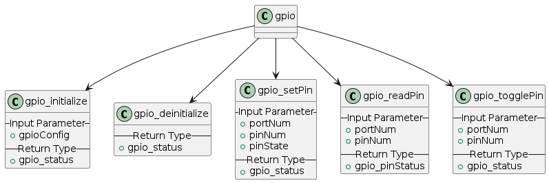
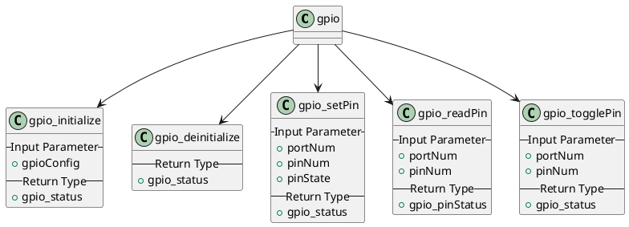

# GPIO Peripheral

## Overview
This contains the basic requirements for the GPIO peripheral and the high level diagram of the peripheral

## Requirements
### Must-have requirements
* **MREQ.1** - The HAL GPIO must be able to initialize based on the given configuration structure
* **MREQ.2** - The HAL GPIO must be able to de-initialize and return the registers to its reset state
* **MREQ.3** - The HAL GPIO must be able to set and get the current pin state
* **MREQ.4** - The HAL GPIO must be able to support the toggling of the pin
* **MREQ.5** - The HAL GPIO must be able to handle the appropriate interrupts
* **MREQ.6** - Handle the appropriate status or error messages

### Nice-to-have requirements
* **NREQ.1** - Use the external interrupt to service any external events connected to the GPIO pin (button press)

## Configuration and Status

### GPIO Peripheral Status
```c
typedef enum
{
    GPIO_OK,
    GPIO_FAIL,
    GPIO_MAX,
} gpio_status

typedef enum
{
    PIN_SET,
    PIN_RESET,
} gpio_pinStatus
```

### Configuration Structure
```c
// Mock GPIO Pin Configuration
typedef struct
{
    uint32_t    gpioOutConfig;      // Sets whether pull-up or pull-down
    uint32_t    gpioSpeed;          // Sets the GPIO speed
    uint32_t    gpioAlternateFn;    // GPIO alternate function
} pin_config

// Mock GPIO Configuration
typedef struct
{
    uint32_t    port;
    uint32_t    pinNumber;
    uint32_t    pinMode;
    uint32_t    initialState;
    pin_config  pinConfig;
} gpio_configuration;
```

## Public API
The following are the generic API for the GPIO peripheral
```c
gpio_status gpio_initialize( const gpio_configuration *gpioConfig )
gpio_status gpio_deinitialize( void )
gpio_status gpio_setPin( uint32_t portNum, uint32_t pinNum, gpio_pinStatus pinState )
gpio_pinStatus gpio_readPin( uint32_t portNum, uint32_t pinNum )
gpio_status gpio_togglePin( uint32_t portNum, uint32_t pinNum )
```



