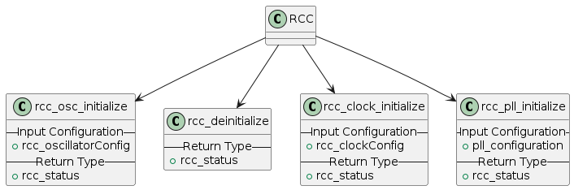
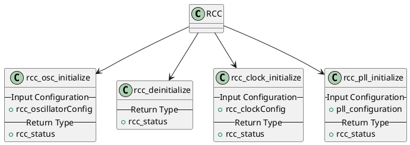

# RCC Peripheral

## Overview
This contains the basic requirements for the RCC peripheral and the high level diagram of the peripheral

## Requirements
### Must-have requirements
* **MREQ.1** - The RCC peripheral must be able to initialize and de-initialize its block
* **MREQ.2** - Must return appropriate status messages to determine the state of the peripheral
* **MREQ.3** - Handle the appropriate status messages
* **MREQ.4** - Set the main clock of the MCU to 8MHz
    * This will be the basis for the UART, GPIO, and TIMER peripherals
* **MREQ.5** - Support the retreival of the current clock value

### Nice-to-have requirements
* **NREQ.1** - Use the PLL block if the MCU supports it.
    * **NREQ.1.1** - Use the PLL block to multiply the MCU clock from 8MHz to 64MHz

## Configuration and Status

### RCC Peripheral Status
```c
typedef enum
{
    RCC_OK,
    RCC_ERROR,
    RCC_MAX,
} rcc_status
```

### Configuration Structure
```c
// RCC PLL Mock Configuration (If the MCU supports)
typedef struct
{
    uint32_t    pllState;
    uint32_t    pllSource;
    uint32_t    pllDiv;
} pll_configuration;

// RCC Oscillator Mock Configuration
typedef struct
{
    rcc_status          clockState;
    uint32_t            clockSource;
#if defined( PLL ) // If PLL is supported
    pll_configuration   pllConfig;
#endif

} rcc_oscillatorConfig

// RCC Clock Selection
typedef struct
{
    uint32_t    clockType;
    uint32_t    clockSource;
    uint32_t    ahbClockDiv;
    uint32_t    apbClockDiv;
} rcc_clockConfig
```

## Public API
The following are the generic API for the RCC peripheral
```c
rcc_osc_initialize( const rcc_oscillatorConfig *rccOscConfig )
rcc_deinitialize( void )
rcc_clock_initialize( const rcc_clockConfig *rccClkConfig )
rcc_pll_initialize( const pll_configuration *pllConfig )
```





